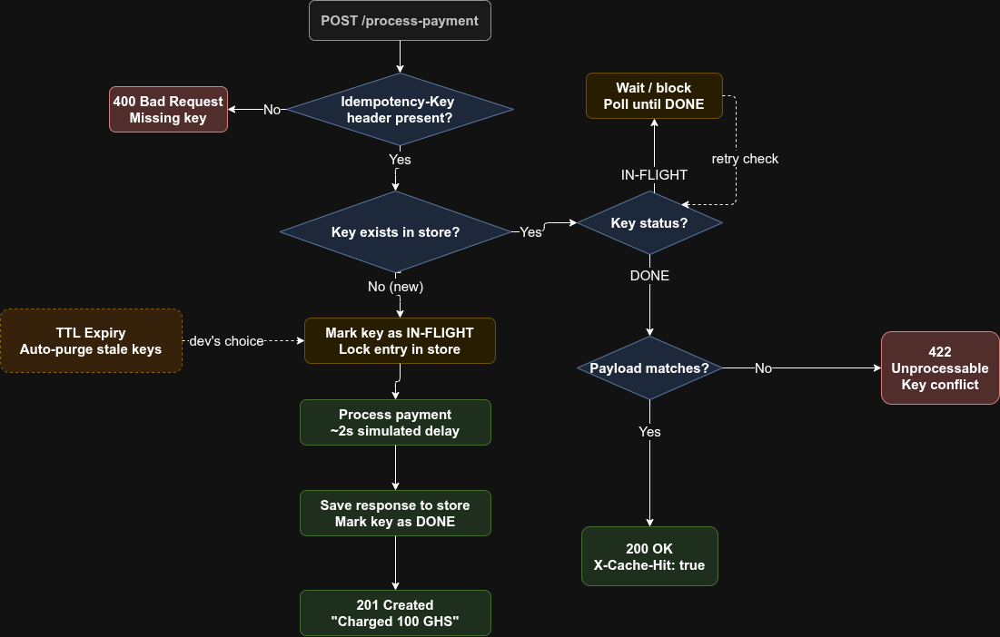
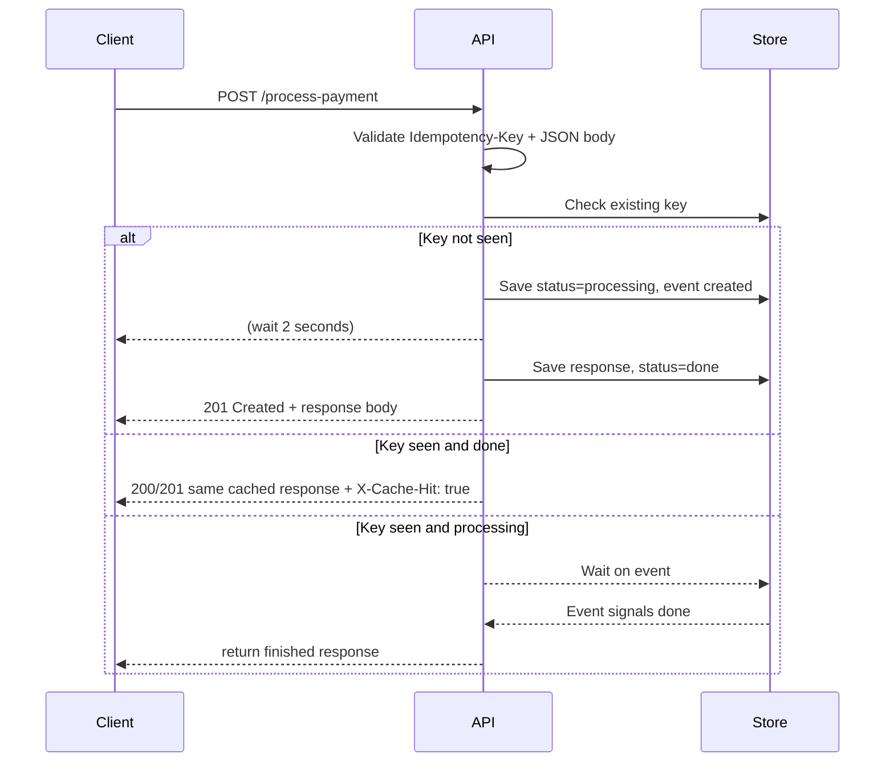

# Idempotency Gateway

A lightweight Python Flask service that ensures payment requests are processed exactly once using `Idempotency-Key` headers.

## Architecture Diagram



## Sequence Diagram



## Summary

This gateway solves the double-charge problem by storing the first successful response for each unique `Idempotency-Key`. Subsequent retry requests with the same key and same payload return the cached response instantly, while requests with the same key and a different payload are rejected.

## Features

- `POST /process-payment` endpoint
- Required header: `Idempotency-Key`
- Required JSON body: `amount`, `currency`
- 2-second simulated payment processing delay
- Duplicate request detection with cached response
- Conflict detection for same key with different request body
- In-flight handling: concurrent duplicate requests wait for the first request to finish
- Developer's Choice: idempotency key expiry (TTL) to prevent stale memory growth and support safe key reuse after a time window

## Setup Instructions

1. Create and activate a virtual environment:

```bash
python3 -m venv venv
source venv/bin/activate
```

2. Install dependencies:

```bash
pip install -r requirements.txt
```

3. Start the server:

```bash
python3 run.py
```

4. Open `http://127.0.0.1:5000/health` to verify the service is running.

## API Documentation

### Root

- `GET /`
- Response: `200 OK`
- Body:

```json
{
  "status": "ok",
  "message": "Idempotency Gateway is running. Use POST /process-payment with Idempotency-Key."
}
```

### Health Check

- `GET /health`
- Response: `200 OK`
- Body:

```json
{
  "status": "ok",
  "message": "Idempotency Gateway is running."
}
```

### Process Payment

- `POST /process-payment`
- Headers:
  - `Idempotency-Key: <unique-key>`
- Body:

```json
{
  "amount": 100,
  "currency": "GHS"
}
```

### Example Successful Request

```bash
curl -X POST http://127.0.0.1:5000/process-payment \
  -H "Content-Type: application/json" \
  -H "Idempotency-Key: order-123" \
  -d '{"amount": 100, "currency": "GHS"}'
```

Response:

```json
{
  "message": "Charged 100 GHS",
  "transaction_id": "TXN-ORDER-12",
  "amount": 100,
  "currency": "GHS",
  "status": "success"
}
```

### Duplicate Request

When the same `Idempotency-Key` and request body are reused, the gateway returns the saved response immediately with header:

- `X-Cache-Hit: true`

### Conflict Request

If the same `Idempotency-Key` is reused with a different body, the gateway returns:

- `409 Conflict`
- Body:

```json
{
  "error": "Idempotency key already used for a different request body."
}
```

### Missing Key

If the `Idempotency-Key` header is missing:

- `400 Bad Request`
- Body:

```json
{
  "error": "Missing required header: Idempotency-Key"
}
```

## Design Decisions

- **In-memory store**: Simple Python dictionaries are used for this exercise, with a lock to prevent race conditions.
- **Request hashing**: Request bodies are hashed using SHA-256 after sorting keys, so body order does not affect equality checks.
- **In-flight waiting**: A `threading.Event` coordinates concurrent requests with the same idempotency key.
- **Response caching**: The first successful response is saved and replayed for duplicate requests.
- **TTL expiration**: Idempotency records expire after 15 minutes to avoid unbounded memory growth and allow safe reuse of stale keys.

## Developer's Choice Feature

### Idempotency Key Expiry (TTL)

A new safety mechanism was added so saved idempotency records expire after 15 minutes. This prevents the service from holding stale responses forever, which is important for memory management in a real-world backend service. It also aligns with best practices: idempotency should be enforced only for a bounded time window.

## Running Tests

Run the unit tests with:

```bash
python3 -m unittest discover tests
```

Expected output: